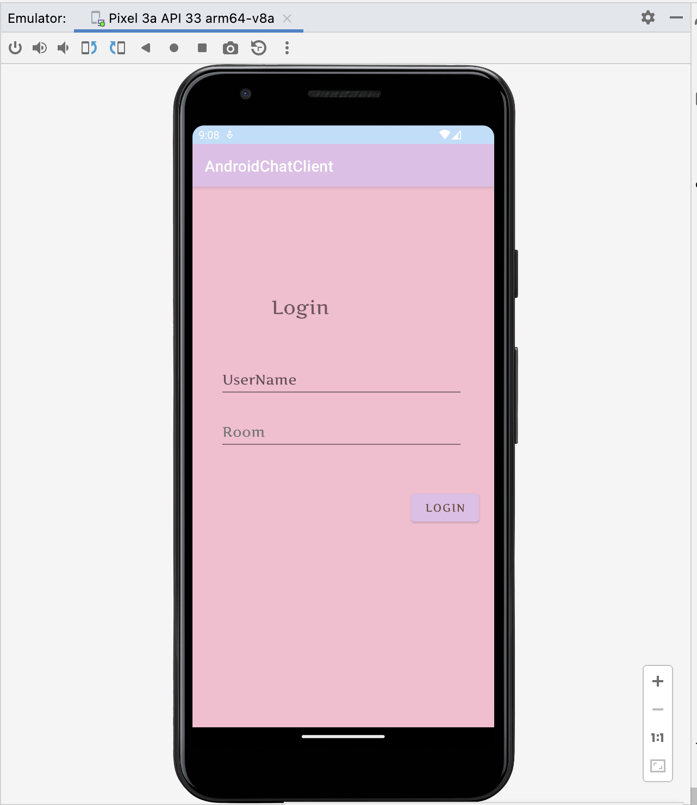
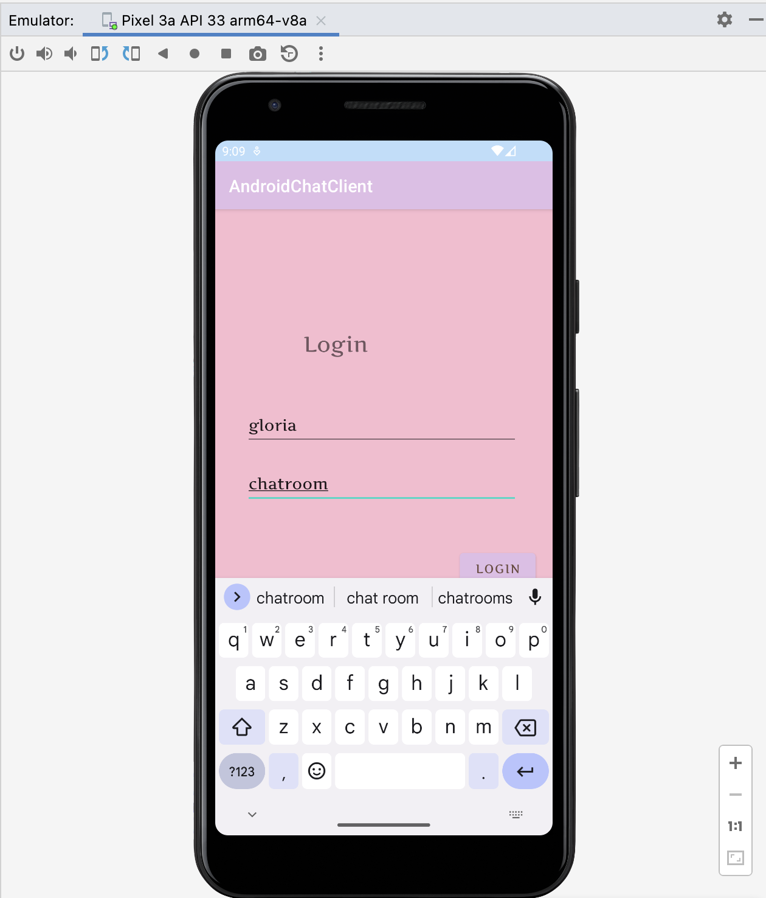
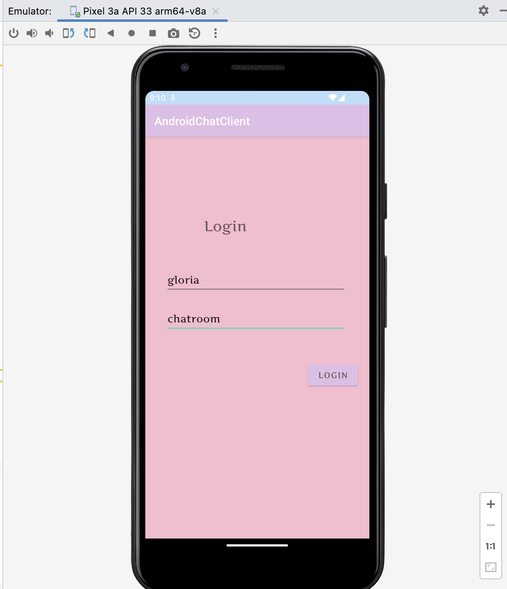
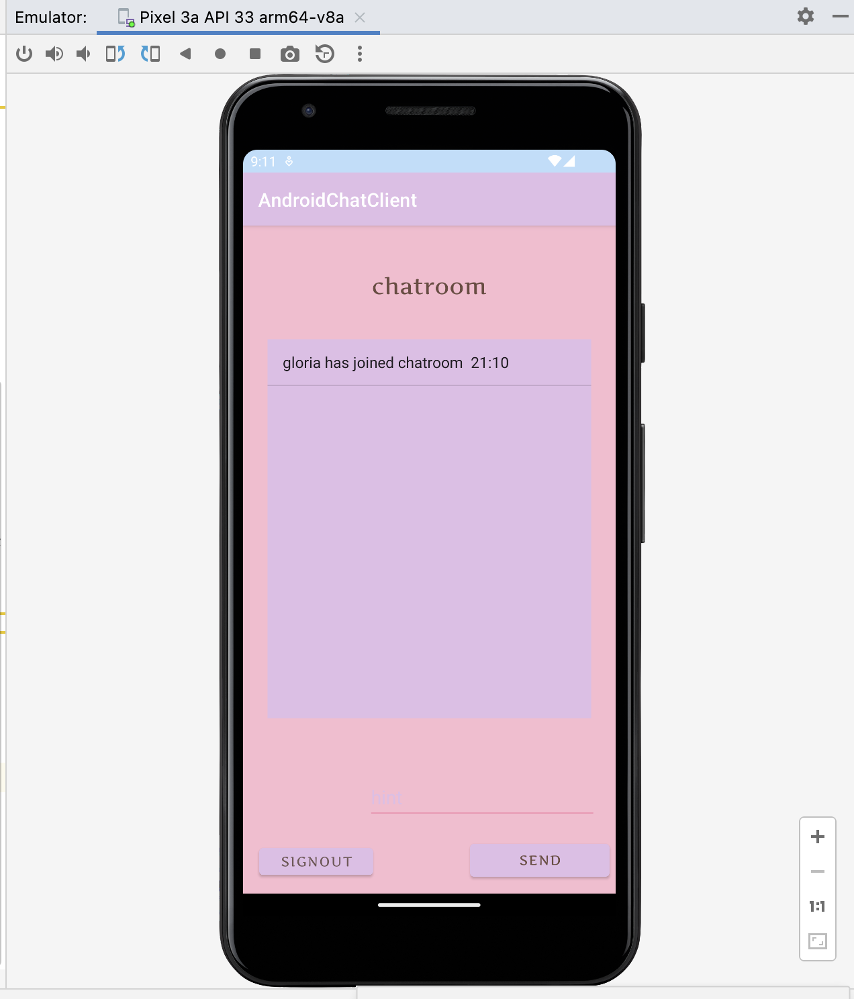
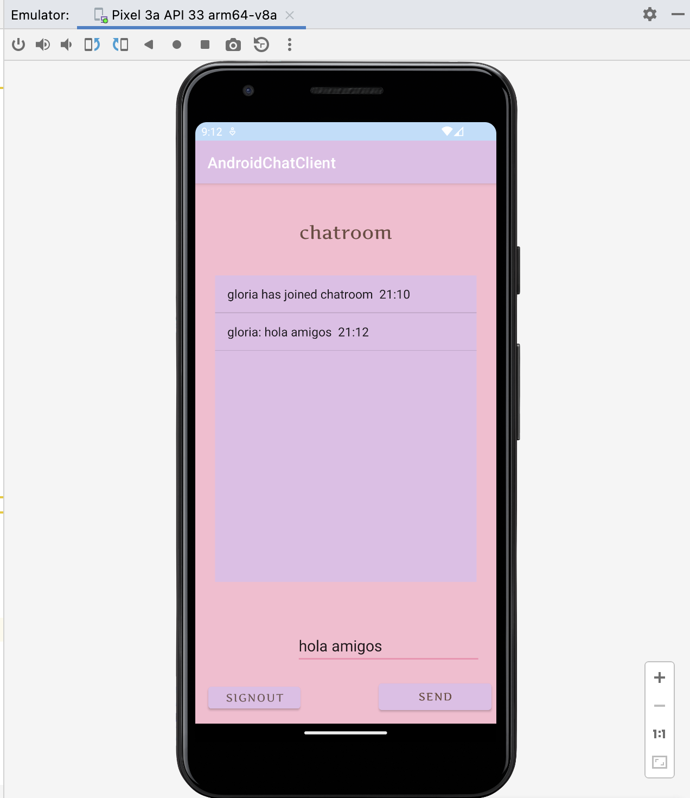
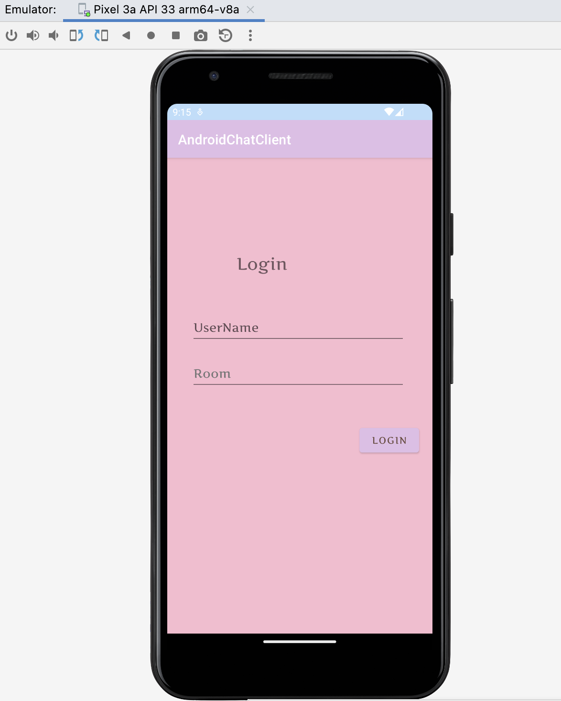
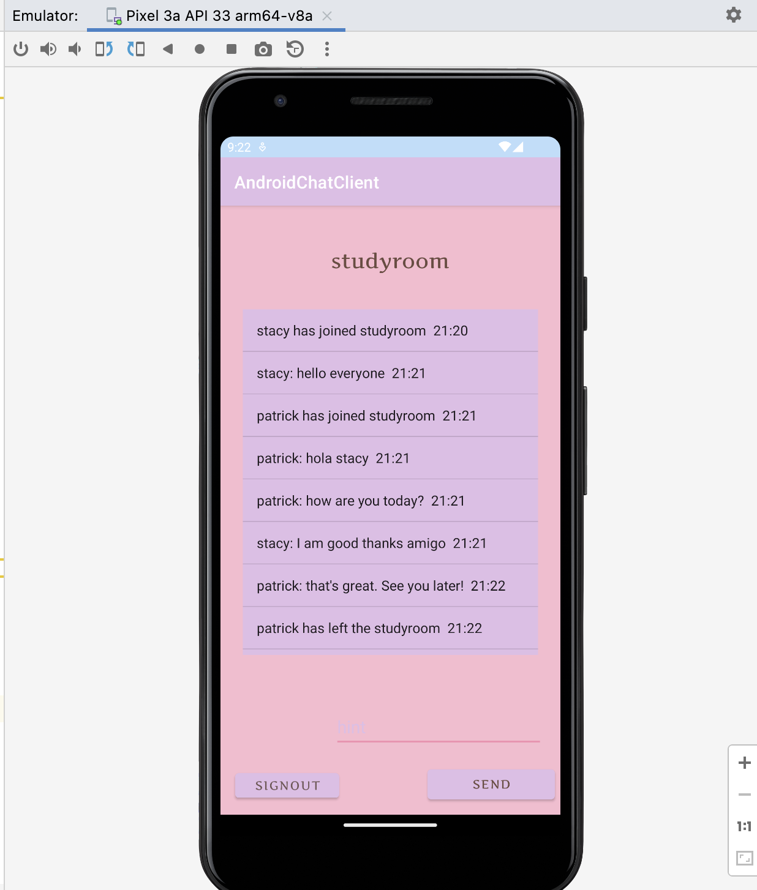

# Android (phone) app

This is a project created using Android Studio. it is an app that allows to talk to the website and send/ receive messages. 

### **Important** **feature**

* The project has two main activities. The login activity `MainActivity` and the chatroom activity `chatboard`
* The web socket class `myWebsocket`  to handle the network on the client side 
* Layout  `ListView ` and `ArrayAdapter ` to display the messages as they come in

### **Steps to run the app**

1.  Open the server. You may use the server found  here :  

https://github.com/gloriadukuzeyesu/CS6011/tree/main/Week5/Day22/ChatSever/src

2. Head to the application and run the the program inside the  Android Studio

3. An Emulator with a login page should pop up. 

   

 

4. Type in your prefered username and room name both in lowe cases and press `button ` ` Login` . As an example: I used username `gloria` and room name is `chatroom`

5. 

   

   

   

   

5. Press button `Login` to enter into your room

   

6.  Your room name should appear at the top of the screen. Your username and little message that you joined the room will appear on the screen. The time stamp you login appears next to your message

7. 

   

   

8. Type in any message  and click send message 

   

   

9. Your username, message, and time stam should appear next to each other other. with the format `username`   then `message` then `timestamp`

10. Try to log out and see what happens. Click on the button `SIGNOUT`.   🤩  You will be taken back to the login page 

    

5. It is important to know that multiple people can join one room at talk to each other as long as they are connected to the same server

6. When one person left, the others are notified 

   

   

Thanks for visiting my first Android Chat APP. I hope you enjoyed my application

Regards,

Gloria 